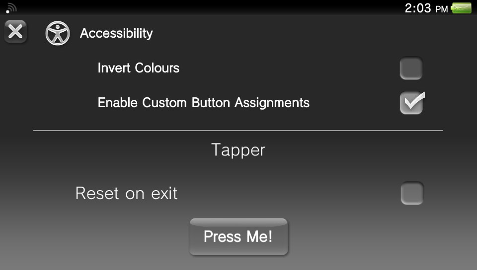

# QuickMenuReborn

Library for developers to easily add their own widgets, to the vita's Quick Menu.

# Install

## Plugin

1. Download the plugin
1. Copy the plugin to your tai folder
1. Add it's path under *main to enable it
1. Make a folder called QuickMenuReborn (exactly that, case sensitive) in ur0: or ux0: (ur0: if you use sd2vita) 
1. Copy qmr_plugin.rco into the folder
1. Reboot

## Developer Library

### VitaSDK / DolceSDK

1. Make sure you have installed the plugin (see above).
1. Download the file dev_pkg.zip
1. Extract it
1. Copy the folder quickmenureborn to your sdk's include folder so that the subdirectory quickmenureborn is inside it.
1. Copy the stubs from vitasdk_stubs to your lib folder, stubs inside stubs are for vdsuite
1. Done

### VDSuite

1. Either follow instructions for vitaSDK but using the vdsuite stubs (recommended) or,
1. Clone Repo
1. Build with cmake and use target install_vdsuite

For usage see usage.md

## Installing plugins that use QuickMenuReborn
Simply drag and drop the plugin in the QuickMenuReborn folder you made earlier.

There is also a sample plugin provided. It's totally useless (don't know why anyone would want it in their menu, but it shows all the features)

